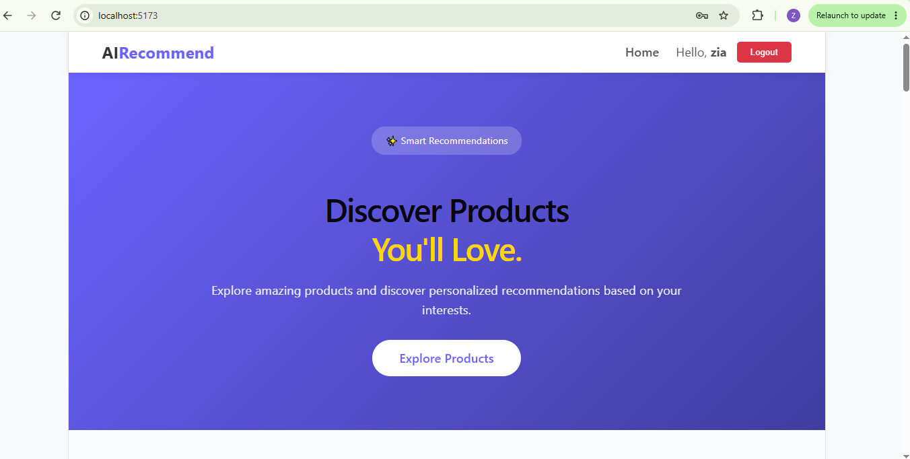
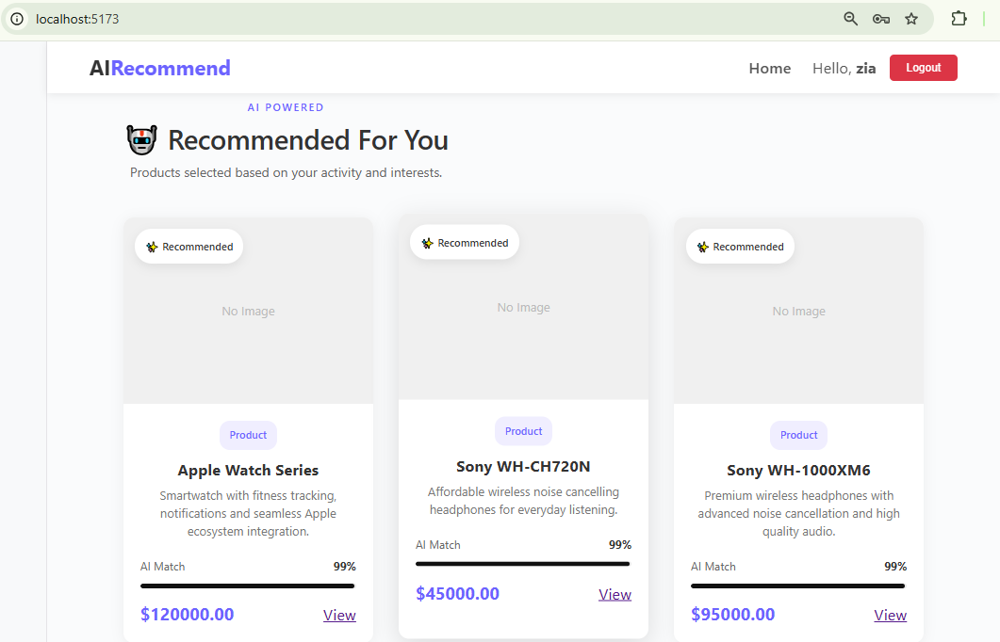

AI Product Recommendation System
A full-stack, AI-powered product recommendation platform built with Django REST Framework and React. The system learns from user interactions — views, clicks, likes, cart actions, and purchases — and delivers personalized recommendations using content similarity and weighted interaction signals.

Project Status
Current Milestone: V2.1 — Content-Based Recommendation System

Implemented Features
User registration and authentication

JWT-based authentication

Product catalog REST API

Product detail page

User interaction tracking

Interaction weighting system

TF-IDF text vectorization

Cosine similarity engine

Personalized product recommendations

Normalized recommendation scores (0–100)

React frontend with Vite

PostgreSQL database

Realistic seeded catalog with 23 products

Tech Stack
Backend
Technology	Purpose
Python	Core language
Django	Web framework
Django REST Framework	REST API
Simple JWT	Authentication
PostgreSQL	Database
scikit-learn	ML / TF-IDF / Similarity
Frontend
Technology	Purpose
React	UI Library
Vite	Build tool
JavaScript	Language
CSS	Styling
Recommendation System
The recommendation engine uses a content-based filtering approach.

Product Text Features
Each product is converted to a text blob containing:

Product name

Description

Category

Brand

TF-IDF + Cosine Similarity
All product text is vectorized using TF-IDF (Term Frequency–Inverse Document Frequency).

Cosine similarity is computed between interacted products and candidate products.

Scores are weighted by interaction strength.

Results are normalized to a 0–100 scale.

Interaction Weights
Interaction	Weight	Meaning
VIEW	1	Weakest signal
CLICK	2	Mild interest
LIKE	3	Clear interest
CART	4	Strong interest
PURCHASE	5	Strongest signal
These weights multiply the cosine similarity score to produce a personalized recommendation score.

How It Works
text
       ┌────────────────────┐
       │  User Interaction  │
       └─────────┬──────────┘
                 ▼
       ┌────────────────────┐
       │ Interaction History│
       └─────────┬──────────┘
                 ▼
       ┌────────────────────┐
       │ Interaction Weight │
       └─────────┬──────────┘
                 ▼
       ┌────────────────────────────────┐
       │ Product Text                   │
       │ (Name + Desc + Category + Brand)│
       └─────────┬──────────────────────┘
                 ▼
       ┌────────────────────┐
       │ TF-IDF Vectorize   │
       └─────────┬──────────┘
                 ▼
       ┌────────────────────┐
       │ Cosine Similarity  │
       └─────────┬──────────┘
                 ▼
       ┌────────────────────┐
       │ Weighted Score     │
       └─────────┬──────────┘
                 ▼
       ┌────────────────────────┐
       │ Personalized Recomms.  │
       └────────────────────────┘
API Reference
Authentication
JWT-based authentication is used for protected endpoints.

Products
http
GET /api/products/
GET /api/products/<id>/
Interactions
Authenticated users can record:
VIEW · CLICK · LIKE · CART · PURCHASE

http
GET  /api/interactions/
POST /api/interactions/
Example Request:

json
{
    "product": 22,
    "interaction_type": "LIKE"
}
Recommendations
http
GET /api/recommendations/
Example Response:

json
{
    "count": 5,
    "results": [
        {
            "id": 20,
            "name": "Sony WH-CH720N",
            "category_name": "Headphones",
            "brand_name": "Sony",
            "recommendation_score": 82.06
        }
    ]
}
Project Structure
text
ai_product_recommendation/
│
├── backend/
│   ├── apps/
│   │   ├── accounts/         # Auth, JWT, user management
│   │   ├── products/         # Product catalog
│   │   ├── interactions/     # User interaction tracking
│   │   └── recommendations/  # Recommendation engine
│   │
│   ├── seed_products.py
│   ├── manage.py
│   └── ...
│
├── frontend/
│   ├── src/
│   │   ├── pages/
│   │   │   ├── Home.jsx
│   │   │   ├── Login.jsx
│   │   │   └── Register.jsx
│   │   │
│   │   ├── css/
│   │   ├── services/
│   │   │   └── api.js
│   │   └── App.jsx
│   │
│   └── ...
│
└── README.md
Recommendation Roadmap
text
V1   Category-Based Recommendation
        ↓
V2   Content-Based Recommendation
        ↓
     TF-IDF + Cosine Similarity
        ↓
V2.1 Interaction Weighting + Score Normalization   ←  Current
        ↓
V2.2 Recommendation Explanations
        ↓
V3   Collaborative Filtering
        ↓
     KNN
        ↓
V4   Hybrid Recommendation System
        ↓
V5   Evaluation + Recommendation Metrics
        ↓
V6   Production Optimization
Seed Product Data
The project ships with 23 realistic products across categories such as:

Laptops

Smartphones

Monitors

Gaming

Headphones

Smartwatches

Accessories

Brands include: Apple, Samsung, Sony, Logitech, ASUS, Dell, HP

Location: backend/seed_products.py

Run (PowerShell):

powershell
Get-Content seed_products.py | python manage.py shell
Running the Backend
powershell
# Go to backend
cd backend

# Activate virtual environment
.\venv\Scripts\Activate.ps1

# Install dependencies
pip install -r requirements.txt

# Run migrations
python manage.py migrate

# Start server
python manage.py runserver
Backend runs at: http://127.0.0.1:8000/

Running the Frontend
powershell
# Go to frontend
cd frontend

# Install dependencies
npm install

# Start dev server
npm run dev
Frontend runs at: http://localhost:5173/

Current Achievement
The system has been tested with multiple user accounts and produces different recommendations for each user based on their interaction history.

This confirms that the engine is personalized, rather than returning a static product list to every user.

Future Improvements
Recommendation explanations

Better recommendation evaluation metrics

Collaborative filtering

KNN-based recommendations

Hybrid recommendation model

Additional interaction signals

Cold-start handling

Recommendation diversity

Performance optimization

Production deployment

Larger product dataset

Purpose
This project is being developed as a practical AI and full-stack engineering project to understand how recommendation systems work from the ground up — starting with interpretable content-based methods and gradually moving toward more advanced recommendation techniques.

License
This project is currently intended for learning, experimentation, and portfolio development.

